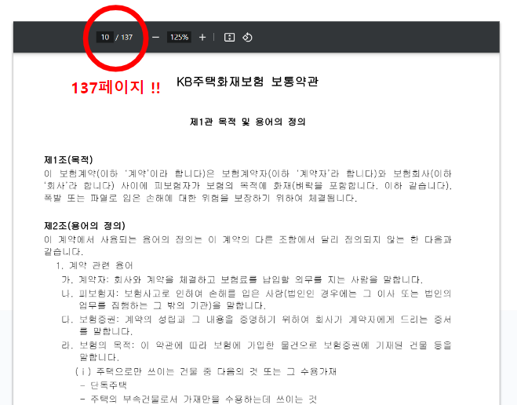
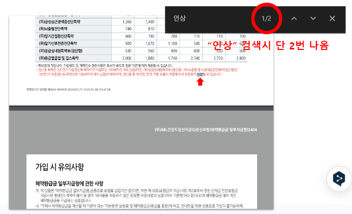
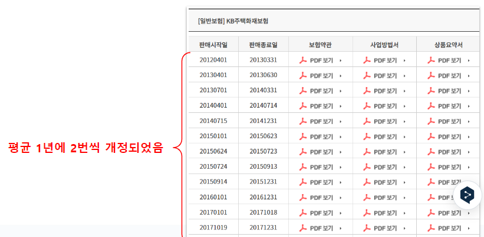
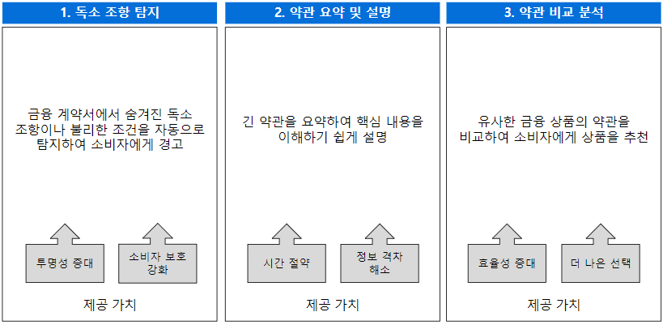
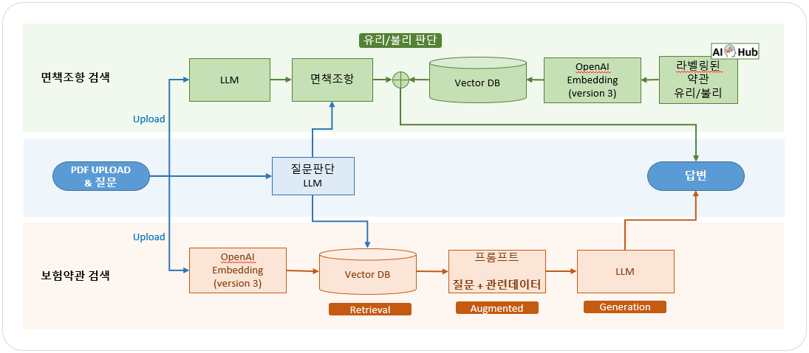

# Blue Moose 팀 소개

금융 분야에서 소비자를 보호하기 위해 AI를 활용하는, 4명으로 구성된 열정적인 팀.


# 문제 정의

소비자는 종종 금융 계약서에 숨겨진 독소 조항이나 불리한 조항을 인지하지 못해 재정적 손실을 입습니다.

- **복잡성**
  
- **불투명성**
  
- **변동성**
  


# 솔루션

위의 문제를 해결하기 위해 AI 기술을 활용하여 금융 계약서의 불리한 조항을 탐지하고, 이를 요약 및 설명하여 소비자를 보호합니다.




# 아키텍처



- 사용자는 약관에 대해 두 가지의 태스크를 수행할 수 있습니다.
  - 계약서에서 추출한 면책조항에 대해 이미 라벨링된 약관을 검색하여 유리 또는 불리를 알 수 있습니다.
  
    ```
    면책조항은 계약 당사자간의 책임을 규정하는 중요한 조항입니다.
    ```
  - 계약서에서 궁금한 부분을 검색하여 빠르게 정보를 얻을 수 있습니다.
- Vector DB는 두 가지 유형의 데이터로 구축됩니다.
  - 계약서 데이터를 페이지 단위로 청킹하여 임베딩합니다.
  - 유리, 분리 두 가지로 분류된 약관 데이터를 임베딩합니다.
- LLM은 다음과 같은 기능을 수행합니다.
  - **질문판단 LLM**: 사용자의 질문 의도 파악하여 면책조항 검색 또는 보험약관 검색 기능을 수행합니다.
  - **면책조항 검색 LLM**: 계약서에서 면책 조항을 추출합니다.
  - **보험약관 검색 LLM**: 사용자 질문과 관련된 계약서의 데이터 청크와 사용자 질문을 해석하고 답변을 생성합니다.